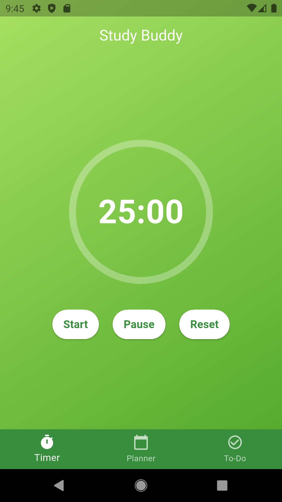
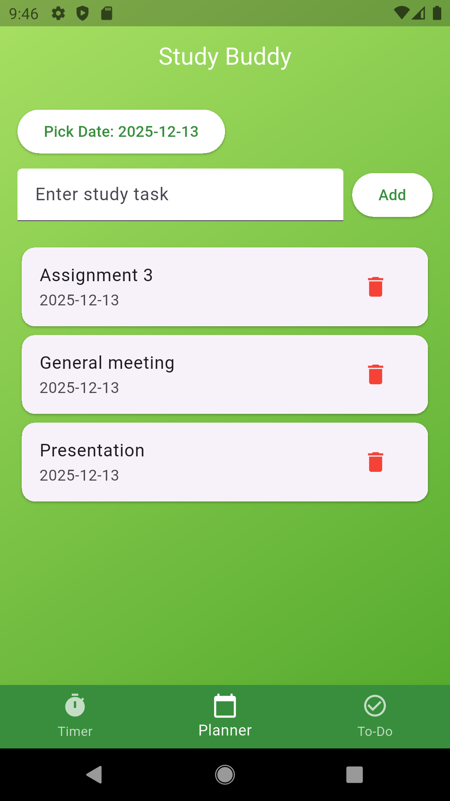
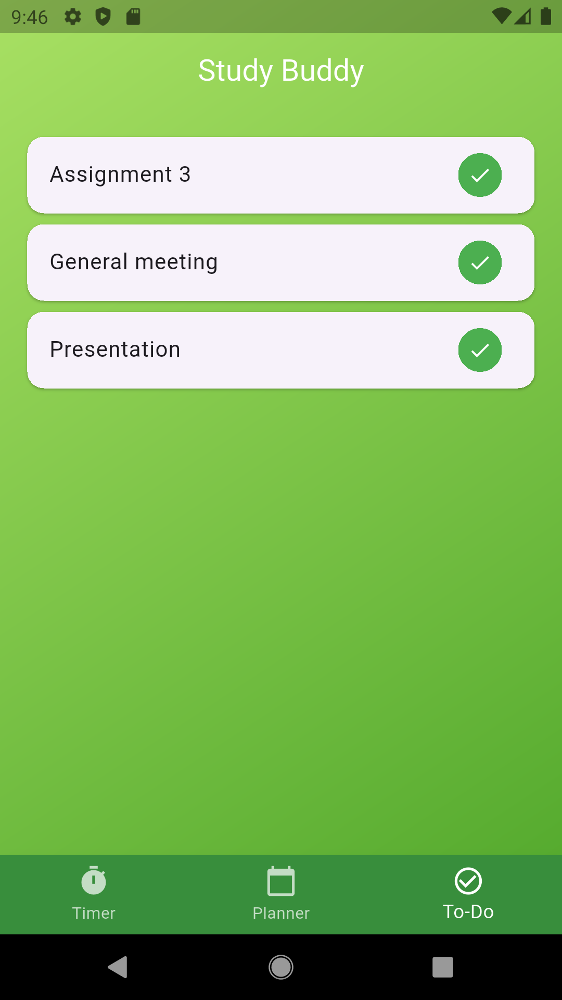

# 📚 Study Buddy – Flutter Mobile App

**Study Buddy** is a simple and offline Flutter mobile application designed to help students stay focused and organized while studying.  
The app combines a **Pomodoro Timer**, **Study Planner**, and **To-Do List** in one place with clean UI and local data storage.

---

## ✨ Features

* ⏱️ **Pomodoro Timer**
  * 25-minute focus timer
  * Start, pause, and reset controls
  * Circular progress indicator
  * Helps improve concentration and productivity

* 🗓️ **Study Planner**
  * Select any date using a calendar
  * Add study tasks for specific days
  * View tasks date-wise
  * Delete tasks easily

* ✅ **To-Do List**
  * Automatically adds planner tasks to To-Do list
  * Mark tasks as completed
  * Keeps track of remaining work

* 💾 **Offline Storage**
  * Uses `SharedPreferences`
  * All data is saved locally
  * Works without internet connection

* 🎨 **Clean UI**
  * Green gradient background
  * Bottom navigation bar
  * Simple and user-friendly design

---

## 🛠️ Built With

* **Flutter**
* **Dart**
* **SharedPreferences (Local Storage)**
* **Material UI**

---

## 📱 Screenshots

<div align="center">





</div>

## 🚀 How to Run This Project on Your PC

### Prerequisites

* Flutter SDK installed
* Android Studio or VS Code
* Android Emulator or Physical Device

### Steps

```bash
git clone https://github.com/ShehanRUSL/study-buddy-flutter-app.git
cd study-buddy-flutter-app
flutter pub get
flutter run
````

---

## 🔒 Data Storage

* Uses **SharedPreferences**
* Saves:

  * Study planner tasks
  * To-Do list tasks
* Data remains even after app restart

---

## 🎯 Future Improvements

* 🔔 Notifications for Pomodoro sessions
* ☁️ Cloud sync (Firebase)
* 🎨 Dark mode
* 📊 Study statistics & reports

---

## 👤 Author

**Shehan Hasantha**
Beginner Flutter Developer

---
